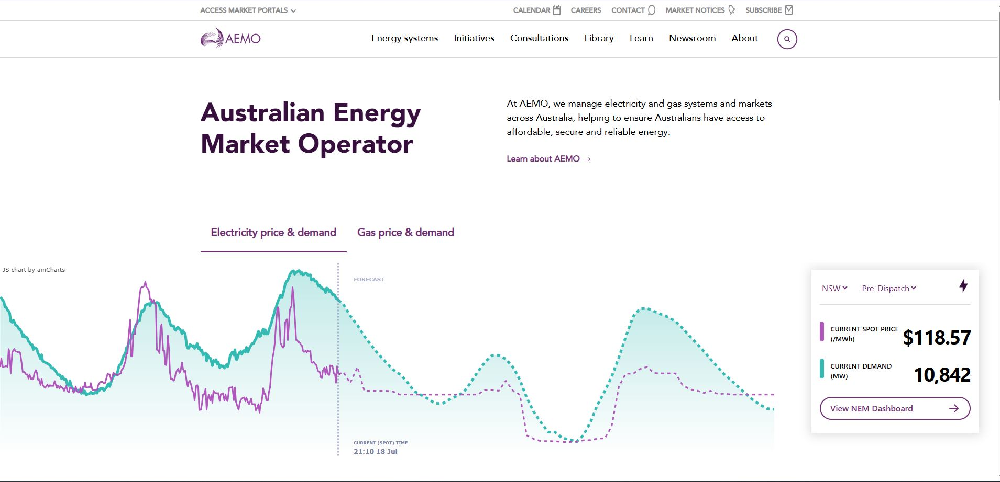
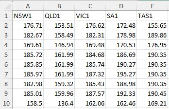

# ⚡ AEMO Market Data Extractor

Your ✨ **automated tool** to fetch public electricity market data from Australia and convert it into a clean, structured **Excel** format, ready for **Power BI**.

Perfect for analysis, reporting, and integration into business intelligence dashboards\!

---

## 🚀 Features

- ⚡️ **Automated Data Fetching** from the AEMO website
- 📄 **Structured .xlsx Export** with separate tabs for each region
- 📊 **Power BI-Ready Output** with consistent formatting
- 🗓️ **Scheduled Downloads** to automatically get the latest monthly data
- 📈 **Time Series Data Collection** for all NEM regions (NSW, VIC, QLD, SA, TAS)
- 🐍 **Built with Python** using `requests`, `openpyxl`, and `pytest`

---

## 📈 Automated Data Workflow

This tool automatically fetches and updates the monthly Regional Reference Prices (RRP) for all NEM regions (NSW, VIC, QLD, SA, TAS), and exports them to a structured XLSX file for seamless Power BI integration.

\<p\>
  \
\</p\>

## 🧪 Sample Output (.xlsx)

\<p\>
  \
\</p\>

## 📦 Installation

Make sure you have a working Python environment, and that [`uv`](https://docs.astral.sh/uv) is installed for dependency management.

---

## ▶️ How to Run

```bash
uv aemo-monthly-extractor-to-xlsx.py
```

## ✅ Testing

Run validation tests with:

```bash
pytest
```

Tests include checks for JSON format, content structure, and error handling.

---

## 📚 License

MIT — Free to use and modify.
